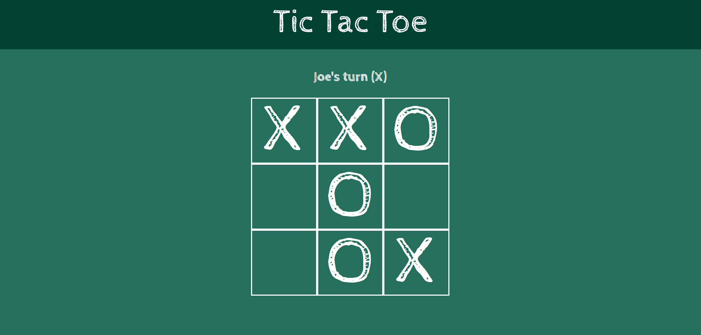

# Tic-Tac-Toe

Plain Javascript implementation of the game "Tic Tac Toe".

## Topics 
- Factory functions
- Module pattern
- HTML forms

## Lessons
- Taking some time to plan ahead of time is always a wise investment, regardless of the project's simplicity. 
- I've improved at separating concerns according to the MVC design pattern. I tend to include excessive business logic on both the model and view.
